# Supported Controls & Properties

FrxEdit recognizes and reconstructs the 15 MSForms control types below. The Reader exposes more diagnostic/native fields than the JSON Writer accepts. This document describes the public patch/template subset; unchanged native fields are preserved even when they are not exposed for editing.

Every generated site supports `name` (string), `parent` (string or null), `leftPt`, `topPt`, `widthPt`, and `heightPt` (numbers in points), `tabIndex` (integer, 0–65535), `tabStop` (boolean), and `visible` (boolean). The behavioral SITE_FLAG projections `siteAutoSize`, `preserveHeight`, `fitToParent`, and `selectChild` are also editable booleans. `tag`, `controlTipText`, `controlSource`, and `rowSource` are Site strings: generated controls can emit supported values, but changing an existing value requires the corresponding native string span to exist. Font-bearing schemas expose `fontName`, `fontSize`, `fontWeight`, `fontEffects`, `fontCharSet`, `fontItalic`, `fontUnderline`, and `fontStrikethrough`.

Property absence is not automatically equivalent to a value. FrxEdit normalizes absent values only for established MS-OFORMS file defaults, including the 8-point default font, `formGroupCount` zero, and the effective Site `BitFlags` default `0x00000033`. Packed unsigned values such as `siteBitFlags`, `fontEffects`, and `formBooleanProperties` preserve the source word and overlay only explicitly requested named changes.

`siteBitFlags` accepts an unsigned 32-bit integer or `0x`-prefixed hexadecimal word. When it is omitted, generated sites use a type-specific word derived from the effective `0x00000033` file default: control defaults such as Label tab-stop behavior and container topology are applied by the factory. When a raw word is supplied, named behavioral values overlay it and its structural bits are validated against that topology. `streamed` and `promoteControls` are read-only structural projections: they determine whether a control occupies its parent's object stream or owns a storage, and containers require promotion. A raw `siteBitFlags` edit that changes either structural bit is rejected instead of silently changing the storage graph.

## Root UserForm properties

The root entry accepts textual `.frm` properties `caption`, `clientLeft`, `clientTop`, `clientWidth`, `clientHeight`, `startUpPosition`, `showModal`, `tag`, `drawBuffer`, `whatsThisButton`, and `whatsThisHelp`. It also accepts the supported binary FormControl color, border, mouse-pointer, scroll/cycle/effect, zoom, displayed/logical size, scroll position, draw-buffer, boolean-bit, and `formGroupCount` fields represented in the schema. `formGroupCount` is the number of control groups on the form and has an MS-OFORMS file default of zero. Textual client dimensions and caption are distinct from binary displayed/logical dimensions and `formCaption`; no-op reconstruction preserves both domains independently.

Recreation templates for UserForm, Frame, MultiPage, and Page may contain `formDesignExData`, an opaque lossless `base64:` FormDesignExData structure. FrxEdit exports it only for template generation, not as an in-place patch property. When `formBooleanProperties` contains `FORM_FLAG_DESINKPERSISTED` (`0x00004000`), generation appends the exact supplied structure or a native-validated type-specific default for backward-compatible templates that omit it. Clearing the flag removes the structure; explicit raw data with the flag clear is rejected. Strict inspection rejects missing, unexpected, malformed, or trailing DesignExtender data.

The root Reader can expose native picture, mouse-icon, and font data, and a no-op build preserves those bytes. The current root Writer and template generator do not accept or synthesize `formPicture`, `formMouseIcon`, or root font properties. `pictureAlignment`, `pictureSizeMode`, and `pictureTiling` describe supported FormControl settings only; they do not add a root picture payload.

The Reader also exposes `formShapeCookie` for native-structure diagnostics. It is not an editable JSON property and is not a hard canonical semantic: its relationship to the host's compiled control types requires PowerPoint/VBE validation, which is outside the automated codec matrix. The comparator reports a changed cookie separately so the native normalization remains visible.

Frame font values observed in FormControl TextProps are carried by recreation templates so a generated Frame can select and rebuild that font encoding. They are not exported in an existing-control patch because in-place Frame font mutation is not yet part of the public Writer contract.

## Picture and mouse-icon values

`picture` and `mouseIcon` accept either an embedded `base64:` native picture stream or a `file://` URI. Relative file URIs are relative to the patch/template JSON file, including when a patch is passed positionally. Exported binary assets can therefore be moved with their JSON document without depending on the shell’s working directory.

`picture` is Writer-backed for CommandButton, Label, TextBox, ComboBox, ListBox, CheckBox, OptionButton, ToggleButton, and Image. `mouseIcon` is Writer-backed for those types plus ScrollBar, SpinButton, and TabStrip. Frame, MultiPage, Page, and the root UserForm do not currently accept picture or mouse-icon payload edits.

## Property validation

The JSON Schema describes the shared shapes of property values. Existing-control patches do not have to repeat a control type, so the CLI resolves the target type from the source form and performs the final compatibility check. Unknown properties and implemented type-incompatible combinations fail the command with a clear error; they are not silently ignored. In particular:

- `pictureSizeMode` and `pictureAlignment` are Image-only control properties.
- `siteAutoSize`, `preserveHeight`, `fitToParent`, and `selectChild` are editable SITE_FLAG projections. `streamed` and `promoteControls` are structural and cannot be edited directly; `siteBitFlags` must retain their type-specific values.
- `formGroupCount` is root-only. `formShapeCookie` is reported for diagnostics but is not an accepted patch/template property.
- `pictureTiling` is limited to Image, Frame, MultiPage, and Page.
- `keepScrollBarsVisible`, `rightToLeft`, raw container dimensions/scroll positions, `formBooleanProperties`, and `formDrawBuffer` are limited to Frame, MultiPage, and Page.
- `min`, `max`, `position`/`value`, `smallChange`, `orientation`, and `delay` are supported by ScrollBar and SpinButton; `largeChange` and `proportionalThumb` are ScrollBar-only.
- `tabCaptions`, `tabTooltips`, `tabNames`, `tabTags`, `tabAccelerators`, `tabFlags`, and `style` are limited to MultiPage and TabStrip. The Writer also accepts the native-facing `listIndex` and `tabStyle` aliases; exports use `value` and `style`.

The Reader additionally reports native TabStrip `tabsAllocated` and `tabData` counts for diagnostics. Newly generated TabStrips set both fields to the number of inserted tabs. Existing raw values are retained unless tab structure is reconstructed; these diagnostic fields are not accepted as independent JSON edits.

## Common control properties

```mermaid
classDiagram
    class UserForm {
        +string caption
        +number clientWidth
        +number clientHeight
        +int32 formGroupCount
        +string backColor (Hex/System)
        +string foreColor (Hex/System)
        +boolean enabled
        +uint16 pictureAlignment (0-4)
        +uint16 pictureSizeMode (0-3)
        +boolean pictureTiling
        +uint16 scrollBars (0-3)
        +boolean keepScrollBarsVisible
        +float logicalHeightPt (Points)
        +float logicalWidthPt (Points)
        +float scrollLeftPt (Points)
        +float scrollTopPt (Points)
        +boolean rightToLeft
        +uint16 mousePointer (0-15, 99)
    }

    class CommandButton {
        +string caption
        +string backColor
        +string foreColor
        +boolean enabled
        +boolean locked
        +boolean wordWrap
        +boolean autoSize
        +boolean default
        +boolean cancel
        +boolean takeFocusOnClick
        +string fontName
        +float fontSize
        +int32 picturePosition (0-12)
        +uint16 mousePointer (0-15, 99)
        +string picture (Base64/File)
        +string mouseIcon (Base64/File)
    }

    class TextBox {
        +string value
        +string backColor
        +string foreColor
        +boolean enabled
        +boolean locked
        +boolean autoSize
        +boolean autoWordSelect
        +boolean autoTab
        +boolean dragBehavior
        +boolean hideSelection
        +boolean multiLine
        +boolean wordWrap
        +boolean selectionMargin
        +int32 maxLength
        +string passwordChar
        +uint16 textAlign (1-3)
        +uint16 scrollBars (0-3)
        +uint16 specialEffect (0-6)
        +uint16 borderStyle (0-1)
        +string borderColor
        +uint16 mousePointer (0-15, 99)
        +string picture (Base64/File)
        +string mouseIcon (Base64/File)
    }

    class Label {
        +string caption
        +string backColor
        +string foreColor
        +boolean enabled
        +boolean autoSize
        +boolean wordWrap
        +string accelerator
        +uint16 textAlign (1-3)
        +uint16 specialEffect (0-6)
        +uint16 borderStyle (0-1)
        +string borderColor
        +uint16 mousePointer (0-15, 99)
        +string picture (Base64/File)
        +string mouseIcon (Base64/File)
    }

    class CheckBox {
        +string caption
        +string value (True/False/Null)
        +string backColor
        +string foreColor
        +boolean enabled
        +boolean locked
        +boolean autoSize
        +boolean wordWrap
        +string accelerator
        +uint16 textAlign (1-3)
        +uint16 specialEffect (0-6)
        +uint16 alignment (0-1)
        +uint16 mousePointer (0-15, 99)
        +string picture (Base64/File)
        +string mouseIcon (Base64/File)
    }

    class OptionButton {
        +string caption
        +string value (True/False/Null)
        +string backColor
        +string foreColor
        +boolean enabled
        +boolean locked
        +boolean autoSize
        +boolean wordWrap
        +string accelerator
        +uint16 textAlign (1-3)
        +uint16 specialEffect (0-6)
        +uint16 alignment (0-1)
        +string groupName
        +uint16 mousePointer (0-15, 99)
        +string picture (Base64/File)
        +string mouseIcon (Base64/File)
    }

    class ToggleButton {
        +string caption
        +string value (True/False/Null)
        +string backColor
        +string foreColor
        +boolean enabled
        +boolean locked
        +boolean autoSize
        +boolean wordWrap
        +string accelerator
        +uint16 textAlign (1-3)
        +int32 picturePosition (0-12)
        +uint16 mousePointer (0-15, 99)
        +string picture (Base64/File)
        +string mouseIcon (Base64/File)
    }
```

## Containers & Advanced Controls

```mermaid
classDiagram
    class Frame {
        +string caption
        +string backColor
        +string foreColor
        +boolean enabled
        +uint16 scrollBars (0-3)
        +boolean keepScrollBarsVisible
        +float logicalHeightPt (Points)
        +float logicalWidthPt (Points)
        +float scrollLeftPt (Points)
        +float scrollTopPt (Points)
        +uint16 specialEffect (0-6)
        +uint16 borderStyle (0-1)
        +string borderColor
        +uint16 mousePointer (0-15, 99)
    }

    class MultiPage {
        +string backColor
        +string foreColor
        +boolean enabled
        +int32 value (Active Page Index)
        +uint16 style (0-2)
        +string[] tabNames
        +string[] tabCaptions
        +string[] tabTags
        +string[] tabTooltips
        +string[] tabAccelerators
        +uint16 mousePointer (0-15, 99)
    }
    
    class Page {
        +string caption
        +boolean enabled
    }
    
    class TabStrip {
        +string backColor
        +string foreColor
        +boolean enabled
        +int32 value
        +uint16 style (0-2)
        +string[] tabNames
        +string[] tabCaptions
        +string[] tabTags
        +string[] tabTooltips
        +string[] tabAccelerators
        +uint16 mousePointer (0-15, 99)
        +string mouseIcon (Base64/File)
    }

    class ComboBox {
        +string value
        +string backColor
        +string foreColor
        +boolean enabled
        +boolean locked
        +boolean autoSize
        +boolean autoWordSelect
        +boolean autoTab
        +boolean hideSelection
        +boolean selectionMargin
        +int32 maxLength
        +uint16 textAlign (1-3)
        +uint16 style (0-2)
        +uint16 matchEntry (0-2)
        +int32 listRows
        +uint16 specialEffect (0-6)
        +uint16 borderStyle (0-1)
        +string borderColor
        +uint16 mousePointer (0-15, 99)
        +string picture (Base64/File)
        +string mouseIcon (Base64/File)
    }

    class ListBox {
        +string value
        +string backColor
        +string foreColor
        +boolean enabled
        +boolean locked
        +uint16 textAlign (1-3)
        +uint16 matchEntry (0-2)
        +uint16 multiSelect (0-2)
        +uint16 specialEffect (0-6)
        +uint16 borderStyle (0-1)
        +string borderColor
        +uint16 mousePointer (0-15, 99)
        +string picture (Base64/File)
        +string mouseIcon (Base64/File)
    }

    class ScrollBar {
        +int32 value (Alias of position)
        +int32 position
        +int32 min
        +int32 max
        +int32 smallChange
        +int32 largeChange
        +int32 delay
        +string backColor
        +string foreColor
        +boolean enabled
        +boolean locked
        +boolean proportionalThumb
        +int32 orientation (-1-1)
        +uint16 mousePointer (0-15, 99)
        +string mouseIcon (Base64/File)
    }

    class SpinButton {
        +int32 value (Alias of position)
        +int32 position
        +int32 min
        +int32 max
        +int32 smallChange
        +int32 delay
        +string backColor
        +string foreColor
        +boolean enabled
        +boolean locked
        +int32 orientation (-1-1)
        +uint16 mousePointer (0-15, 99)
        +string mouseIcon (Base64/File)
    }

    class Image {
        +string backColor
        +boolean enabled
        +boolean autoSize
        +uint16 pictureAlignment (0-4)
        +uint16 pictureSizeMode (0-3)
        +boolean pictureTiling
        +string picture (Base64/File)
        +uint16 specialEffect (0-6)
        +uint16 borderStyle (0-1)
        +string borderColor
        +uint16 mousePointer (0-15, 99)
        +string mouseIcon (Base64/File)
    }

    MultiPage *-- Page : contains
```

## Coordinate & Dimension System

FrxEdit primarily operates in **points (pt)**, which are independent of display DPI mapping.

In JSON patches, prefer `leftPt`, `topPt`, `widthPt`, and `heightPt`.

Raw `left`, `top`, `width`, and `height` values use the underlying Site or object metric and are intended mainly for diagnostics and lossless round trips.

## Enum Value References

For properties requiring an integer enum, FrxEdit uses the standard MS-Forms VBA constants exactly as defined by Microsoft. Use the integer values below in your JSON patches.

### fmPictureAlignment (`pictureAlignment`)

* `0`: fmPictureAlignmentTopLeft
* `1`: fmPictureAlignmentTopRight
* `2`: fmPictureAlignmentCenter
* `3`: fmPictureAlignmentBottomLeft
* `4`: fmPictureAlignmentBottomRight

### fmPictureSizeMode (`pictureSizeMode`)

* `0`: fmPictureSizeModeClip
* `1`: fmPictureSizeModeStretch
* `3`: fmPictureSizeModeZoom

### fmScrollBars (`scrollBars`)

* `0`: fmScrollBarsNone
* `1`: fmScrollBarsHorizontal
* `2`: fmScrollBarsVertical
* `3`: fmScrollBarsBoth

### fmPicturePosition (`picturePosition`)

* `0`: fmPicturePositionLeftTop
* `1`: fmPicturePositionLeftCenter
* `2`: fmPicturePositionLeftBottom
* `3`: fmPicturePositionRightTop
* `4`: fmPicturePositionRightCenter
* `5`: fmPicturePositionRightBottom
* `6`: fmPicturePositionAboveLeft
* `7`: fmPicturePositionAboveCenter
* `8`: fmPicturePositionAboveRight
* `9`: fmPicturePositionBelowLeft
* `10`: fmPicturePositionBelowCenter
* `11`: fmPicturePositionBelowRight
* `12`: fmPicturePositionCenter

### fmTextAlign (`textAlign`)

* `1`: fmTextAlignLeft
* `2`: fmTextAlignCenter
* `3`: fmTextAlignRight

### fmSpecialEffect (`specialEffect`)

* `0`: fmSpecialEffectFlat
* `1`: fmSpecialEffectRaised
* `2`: fmSpecialEffectSunken
* `3`: fmSpecialEffectEtched
* `6`: fmSpecialEffectBump

### fmBorderStyle (`borderStyle`)

* `0`: fmBorderStyleNone
* `1`: fmBorderStyleSingle

### fmAlignment (`alignment`)

* `0`: fmAlignmentLeft
* `1`: fmAlignmentRight

### fmMatchEntry (`matchEntry`)

* `0`: fmMatchEntryFirstLetter
* `1`: fmMatchEntryComplete
* `2`: fmMatchEntryNone

### fmMultiSelect (`multiSelect`)

* `0`: fmMultiSelectSingle
* `1`: fmMultiSelectMulti
* `2`: fmMultiSelectExtended

### fmOrientation (`orientation`)

* `-1`: fmOrientationAuto
* `0`: fmOrientationVertical
* `1`: fmOrientationHorizontal

### fmMousePointer (`mousePointer`)

* `0`: fmMousePointerDefault
* `1`: fmMousePointerArrow
* `2`: fmMousePointerCross
* `3`: fmMousePointerIBeam
* `6`: fmMousePointerNESW
* `7`: fmMousePointerNS
* `8`: fmMousePointerNWSE
* `9`: fmMousePointerWE
* `10`: fmMousePointerUpArrow
* `11`: fmMousePointerHourGlass
* `12`: fmMousePointerNoDrop
* `13`: fmMousePointerAppStarting
* `14`: fmMousePointerHelp
* `15`: fmMousePointerSizeAll
* `99`: fmMousePointerCustom

## Color Properties

Properties like `backColor`, `foreColor`, and `borderColor` accept three different formats:

1. **Web Hex Format**: The standard web format `"#RRGGBB"` (e.g., `"#FF0000"` for pure red). FrxEdit automatically translates this to the internal MS-Forms `0x00BBGGRR` format.
2. **Legacy VBA Format**: The exact VBA hex format `"&H00BBGGRR&"`.
3. **System Colors**: A literal string representing a native OS system color.

### Supported System Colors

The following literal strings can be used to assign dynamic OS UI colors:
* `"systemScrollbar"`
* `"systemBackground"`
* `"systemActiveCaption"`
* `"systemInactiveCaption"`
* `"systemMenu"`
* `"systemWindow"`
* `"systemWindowFrame"`
* `"systemMenuText"`
* `"systemWindowText"`
* `"systemCaptionText"`
* `"systemActiveBorder"`
* `"systemInactiveBorder"`
* `"systemAppWorkspace"`
* `"systemHighlight"`
* `"systemHighlightText"`
* `"systemButtonFace"`
* `"systemButtonShadow"`
* `"systemGrayText"`
* `"systemButtonText"`
* `"systemInactiveCaptionText"`
* `"systemButtonHighlight"`
* `"system3DDarkShadow"`
* `"system3DLight"`
* `"systemInfoText"`
* `"systemInfoBackground"`

